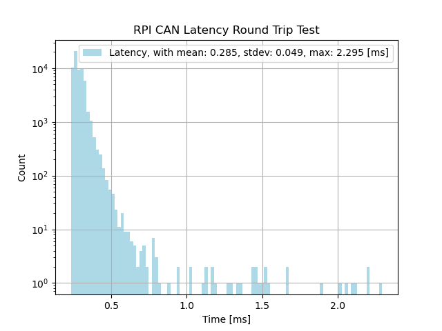
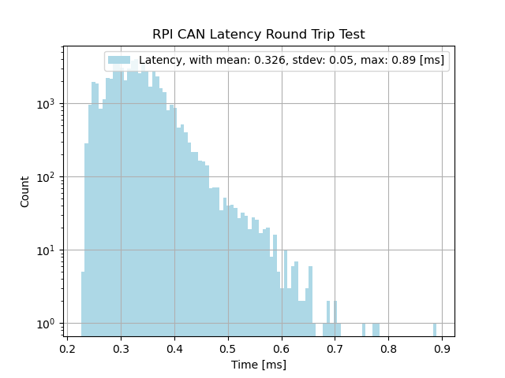

# NTURT RPI CAN Latency Test

## Introduction

This ROS2 package is used for determining the latency inherent to ROS2 node -- ROS2 transport layer -- ros2_socketcan (replacement of socket_can_bridge in ROS1) -- socketCAN -- CAN HAT. In order to properly pin point the latency source of the controll system.

This test is basically a `round trip test`, where the message will first be sent as described above, and then sent back in similar order. If neglecting the latency of the response side (where the exact same message is sent back to rpi, and hopely the respond side is at low latency such as a ,icrocontroller), the latency can be calculated by dividing the total latency by two.

## Usage

### Running the test

The test can be run by using the launch file `nturt_rpi_can_latency_test.launch.py` by

```bash=
ros2 launch nturt_rpi_can_latency_test nturt_rpi_can_latency_test.launch.py
```

### Launch Configuration

There are couple launch parameters defined in the `nturt_rpi_can_latency_test.launch.py` launch file:

1. `using_fake_socket_can_bridge` - bool: Whether to use fake socket_can_bridge (only echoes the can messages sent from the test node back to it self), default to `false`.
2. `send_id` - unsigned int: The can id that the can test message will be sent [^1], default to `0x010`.
3. `receive_id` - unsigned int: The can id that will be received as the responding can test message [^1], default to `0x020`.
4. `is_echo_server` - bool: Whether this test is run as a echo server that will not perform the test, but rather echo can frames with id equals to `send_id` back, with id equals to `receive_id`, default to `false`.
5. `test_period` - double: Period between each test can signals are sent [s], default to `0.1`.
6. `test_length` - double: How long the test will run [s], default to `60.0`.
7. `logging_file_name` - string: The file name that the test data file will be [^2](note that it outputs a `csv` file), default to `<current_time>.csv`.

[^1]: In order to avoid potential problems, the send_id and receive_id should be different.

[^2]: The test data file will be at the the share directory of this package, namely `<path_to_workspace>/install/nturt_rpi_can_latency_test/`.

### Plotting Tool

There's also a plotting tool available for visualizing the test data, it can be run by

```bash=
ros2 run nturt_rpi_can_latency_test plot_test_result.py
```

## Test Result

### CAN Latency Round Trip Test

TODO

### ROS2 Message Round Trip Test

By setting `using_fake_socket_can_bridge` launch parameter to true, this test can also be used as a round trip test for ros2 message, the results are shown here:[^3]

[^3]: The test stands for 56 bytes of constant message size, and test messages were sent every $1ms$ for $1min$.

#### Non-realtime[^4]



#### Non-realtime, Stressed[^4]


#### Realtime[^4]


#### Realtime, Stressed[^4]



[^4]: The title of the figures are wrong, but I'm too lazy to change them.
